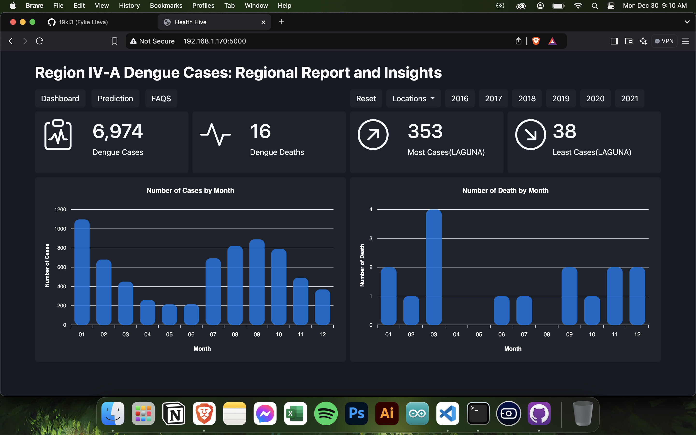
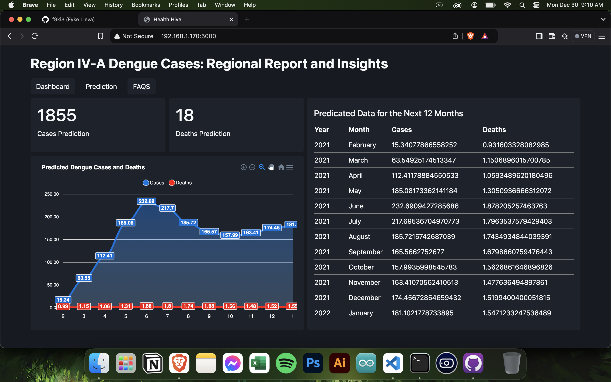
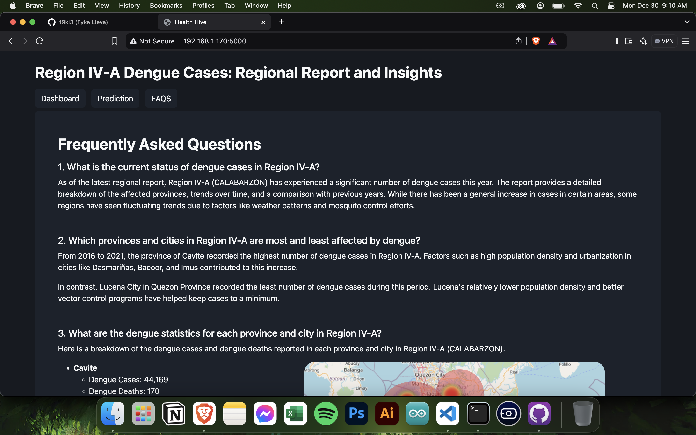
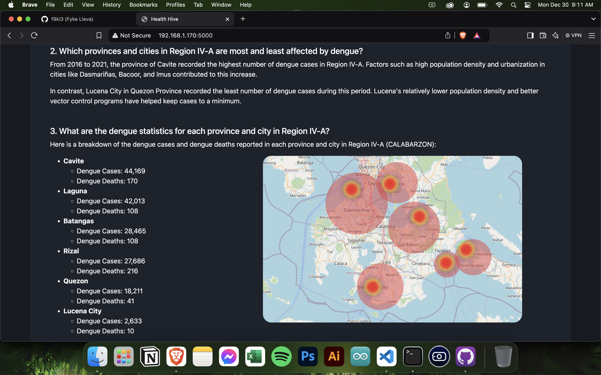

# Health Hive

Health Hive is a data visualization project that provides insightful analysis of Philippine dengue cases in Region IV-A. The project leverages interactive charts and detailed reports to make data more accessible and actionable for researchers, policymakers, and the general public.

## Features
- Interactive visualizations of dengue cases by location, time period, and demographic data.
- Trend analysis to identify patterns and hotspots.
- Prediction for the next 12 months.
- User-friendly interface with intuitive navigation.

## Technologies Used
- **Frontend**: HTML, CSS, JavaScript (apeks.js for visualizations)
- **Backend**: Python (Flask framework)
- **Database**: MySQL
- **Hosting**: Deployed on a local server or cloud platform

## Installation Instructions
1. **Clone the Repository**
   ```bash
   git clone https://github.com/f9ki3/PhilippinesDengueCases2016-2020.git
   cd health-hive
   ```
2. **Set Up Virtual Environment**
   ```bash
   python3 -m venv venv
   source venv/bin/activate  # On Windows: venv\Scripts\activate
   ```
3. **Install Dependencies**
   ```bash
   pip install -r requirements.txt
   ```
4. **Set Up Database**
   - Import the provided SQL file into MySQL.
   - Update the `config.py` file with your database credentials.

5. **Run the Application**
   ```bash
   flask run
   ```
   The application will be accessible at `http://127.0.0.1:5000`.

## Usage Instructions
- Navigate to the homepage to view an overview of dengue cases.
- Use the filters and selectors to customize the data visualizations.
- Download reports or export data for offline analysis.

## Screenshots
1. **Dashboard Overview**
   

2. **Prediction Analysis**
   

3. **Frequently Asked Questions**
   
   

## Contributing
We welcome contributions from the community! Feel free to fork the repository and submit pull requests. Please follow the [contributing guidelines](CONTRIBUTING.md) for more details.

## License
This project is licensed under the MIT License. See the [LICENSE](LICENSE) file for more information.

## Contact
For questions, suggestions, or feedback, please contact:
- **Email**: floterina@gmail.com
- **GitHub**: [PhilippinesDengueCases2016-2020](https://github.com/f9ki3/PhilippinesDengueCases2016-2020.git)

